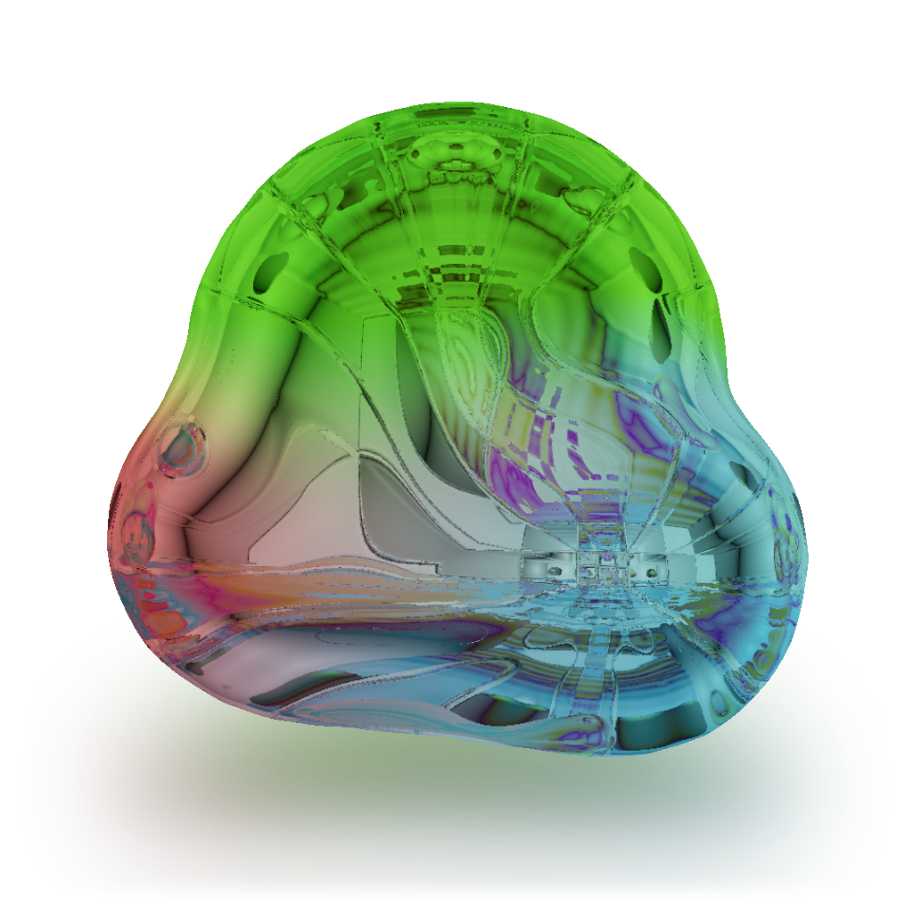
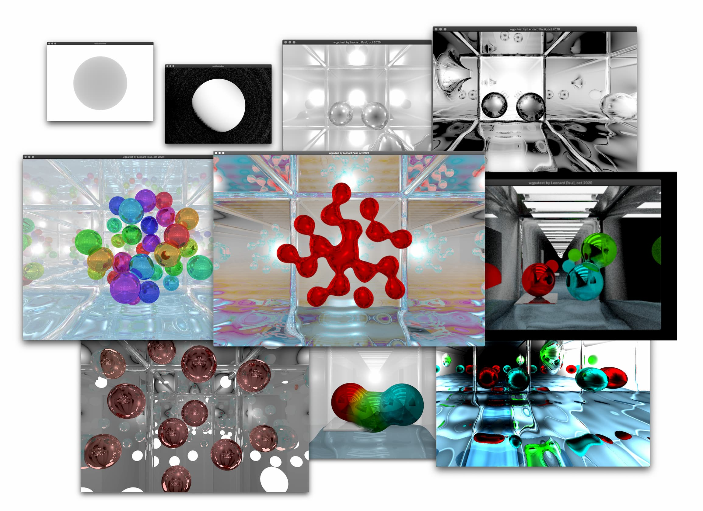

# wgputest
*gpu-based raymarcher; initial purpose: learning*

 

*Try yourself under releases! (m1)*

First experiment playing around with shaders and native apps using rust/winit/wgpu. The raytracer is written "from scratch" with glsl, using pure math and logic to simulate millions of lightrays raymarching around a world defined through SDF. Below are some snapshots, some realtime (with phong lighting and low reflection counts), others more time consuming.

### Get started

- (install rust)
- `clone <repo> <name> && cd $_`
- get glslangValidator https://github.com/KhronosGroup/glslang/releases/tag/master-tot
	- download, unzip, place somewhere nice + add bin to path, (macos: right-click -> open, first time to allow for SIP), new terminal window
	- rm -rf assets/gen/spv # to trigger glslangValidator recompilation on first start
- `cargo run --release` (only tested on osx, may have path issues on windows; if you have glslangValidator installed (google) + in the PATH, try editing `assets/shaders/shader.frag` and it should re-render automatically; also try pressing/holding `R` while moving cursor if `mousex/mousey` is used in fragment shader for interactivity, though resizing window too large might be troublesome as there is currently no debouncing...)
- `cargo install cargo-bundle` and `cargo bundle --release` to create "app"

### Misc

Created by Leonard Pauli, autum 2020.  
Copyright © Leonard Pauli 2020.

For licensing, contact us.
