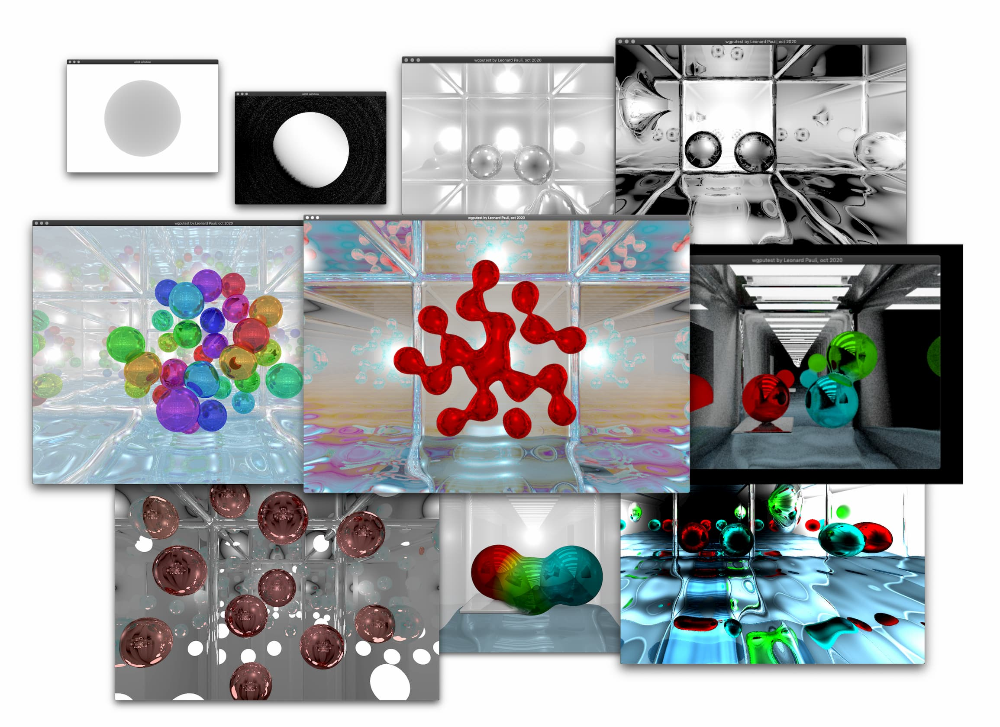

# wgputest
*gpu-based raymarcher; initial purpose: learning*

Några renderingar från arbetet med en raytracer (inda uppgift), skriven ”from scratch” med glsl, winit,wgpu, och rust; raymarching med SDF – vissa kör i realtime (med phong lighting, och några få reflectionbounces) – andra är något mer krävande

### get started

- (install rust)
- `clone <repo> <name> && cd $_`
- get glslangValidator https://github.com/KhronosGroup/glslang/releases/tag/master-tot
	- download, unzip, place somewhere nice + add bin to path, (macos: right-click -> open, first time to allow for SIP), new terminal window
	- rm -rf assets/gen/spv # to trigger glslangValidator recompilation on first start
- `cargo run --release` (only tested on osx, may have path issues on windows; if you have glslangValidator installed (google) + in the PATH, try editing `assets/shaders/shader.frag` and it should re-render automatically; also try pressing/holding `R` while moving cursor if `mousex/mousey` is used in fragment shader for interactivity, though resizing window too large might be troublesome as there is currently no debouncing...)
- `cargo install cargo-bundle` and `cargo bundle --release` to create "app"

### misc

Created by Leonard Pauli, autum 2020.  
Copyright © Leonard Pauli 2020.

For licensing, contact us.
